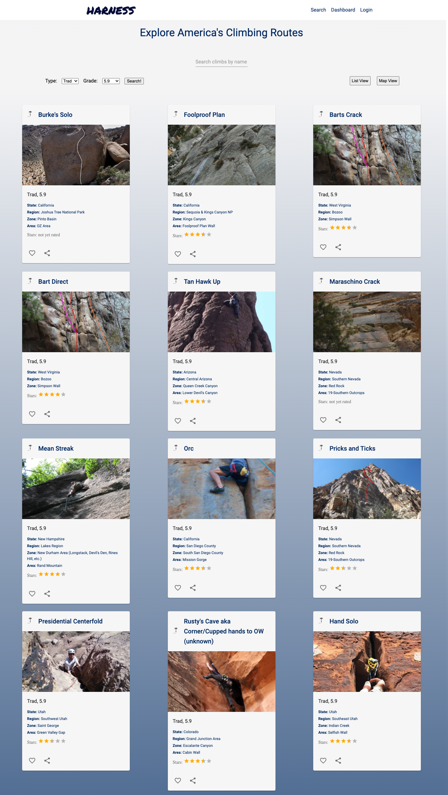
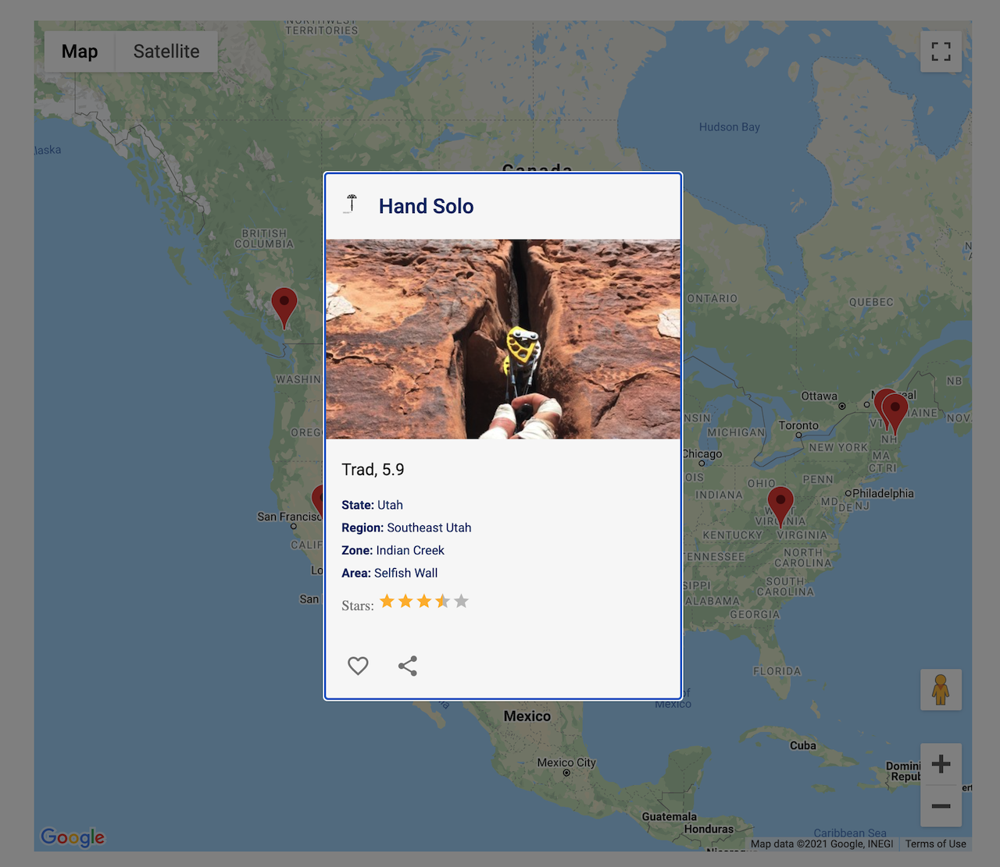

# harness

Harness is site to explore rock climbs in North America and beyond.

Search our database of almost 50,000 climbs by name, preferred type (trad or sport) or difficulty (grade).
Currently in development. 

### List View

### Google Maps API View
 
 

### Coming Soon: Personalized dashboard to log and track training progress. 

